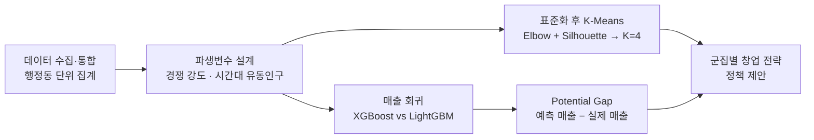
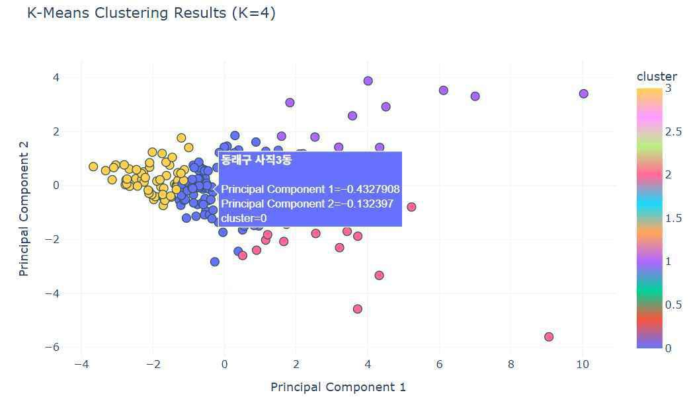
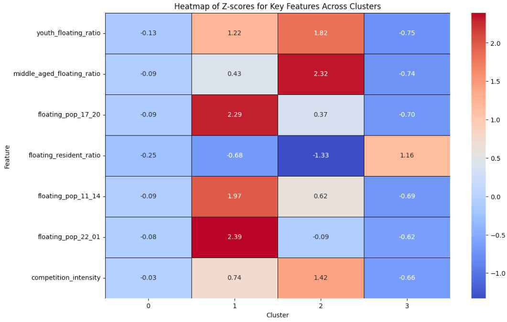

# 청년 창업가를 위한 부산 상권 입지 제안
### 행정동 상권 유형화(K-Means)와 매출 예측(LightGBM)으로 찾은 "잠재력이 남은 동네"

**DatoryLab (부산대학교 데이터사이언스전문대학원) · 부산시 요청 과제**

 
내 도구

 
팀 도구

> **English summary** — Only 15.9% of Korean founders under 30 survive five years, and restaurants (22.8% five-year survival) are where young founders cluster. In this DatoryLab project (Pusan National University Graduate School of Data Science), requested by the City of Busan, a four-person team covered all ~200 administrative districts (*dong*) of Busan: it combined floating-population, card-spending and restaurant data, engineered market features (competition intensity, floating-to-resident ratio, youth/middle-aged share, time-of-day population), **segmented commercial districts with K-Means (K = 4)**, and **predicted monthly restaurant sales with LightGBM (R² = 0.897 with a log target)**. The gap between predicted and actual sales ("Potential Gap") highlights districts whose conditions promise more than they currently earn. The team turned the results into cluster-specific start-up support proposals. **My part was the data exploration and data engineering;** the derived features, clustering, sales-prediction models, Streamlit dashboard and report were the team's work.

---

## 1. 한눈에 보기

| 항목 | 내용 |
|---|---|
| 질문 | 부산에서 청년이 음식점을 연다면, **어느 행정동이 조건에 비해 기회가 남아 있는가?** |
| 분석 단위 | 부산광역시 전체 행정동 (약 200개) |
| 목표 변수 | 행정동별 요식·유흥 업종 월평균 매출액 |
| 방법 | 파생변수 설계 → K-Means 상권 유형화 → XGBoost / LightGBM 매출 회귀 → Potential Gap |
| 핵심 결과 | 상권 **4유형** 도출 · LightGBM **R² 0.897** · 잠재력 상·하위 10개 동 |

## 2. 문제 정의

- 한국 창업기업의 5년 생존율은 **33.8%**로 OECD 평균(45.4%)보다 낮고, 30세 미만 청년 창업가는 **15.9%**에 그친다.
- 청년 창업이 몰리는 **숙박·음식점업**의 5년 생존율은 **22.8%**로, 다섯 곳 중 네 곳이 5년 안에 문을 닫는다.
- 부산은 성장 정체와 청년 인구 유출을 함께 겪고 있어 청년 창업의 성공이 곧 도시 문제다.
- 같은 메뉴와 역량을 가진 음식점이라도 **어느 동에서 시작하느냐**에 따라 성과가 달라진다. 그런데 지금의 입지 선정은 창업자의 감이나 단편적인 정보에 기대고 있다.

## 3. 데이터

| 구분 | 내용 |
|---|---|
| 생활인구 | 행정동별 성별·시간대별·연령대별 생활인구 (월별 일평균) |
| 소비매출 | 행정동별 성별·시간대별·업종(대분류)별·연령대별 소비매출 (월별 일평균) |
| 음식점업 | 행정동별 음식점 수, 업종(한식·중식·일식·카페 등)별 통합 데이터 |

출처: [부산 Big-데이터웨이브](https://data.busan.go.kr/), [공공데이터포털](https://www.data.go.kr/). 저장소에는 행정동 단위로 집계된 표가 들어 있습니다. 생활인구·소비매출을 행정동 × 월로 피벗·병합한 통합 테이블(`src/dashboard/통합_행정동_데이터_1st.csv`), 행정동별 음식점 수(`src/data/restaurant_counts/`, `src/data/processed/`), 대형마트 수(`src/data/processed/대형마트수/`) 등입니다. 점포 단위 자료나 개인정보는 들어 있지 않습니다.

**파생변수**

| 변수 | 의미 |
|---|---|
| 경쟁 강도 | 유동인구 1명당 음식점 수 — 상권의 경쟁 치열도 |
| 유동·주거 비율 | 상업지형과 주거지형을 가르는 지표 |
| 청년 / 중장년 유동인구 비율 | "젊은 상권"과 "직장인 상권" 구분 |
| 시간대별 유동인구 | 11–14시(점심), 17–20시(저녁), 22–01시(야간) |

## 4. 분석 방법

아래 분석(파생변수, 군집 분석, 매출 예측, Potential Gap)은 팀이 진행했다. 내가 맡은 부분은 [8. 나의 역할](#8-나의-역할)에 적었다.

1. **통합·전처리**: 모든 데이터를 행정동 단위로 집계·피벗하고, 거리 기반 군집을 위해 표준화했다.
2. **상권 유형화**: 소비·생활인구·경쟁 특성이 비슷한 동을 묶기 위해 K-Means를 썼고, Elbow와 Silhouette로 K=4를 정했다.
3. **매출 예측**: XGBoost와 LightGBM을 비교하고, 치우친 매출 분포를 로그 변환했다.
4. **Potential Gap**: 조건으로 예측한 매출에서 실제 매출을 뺐다. 값이 클수록 **조건에 비해 아직 덜 번 동네**다.

## 5. 결과

### 5-1. 상권 4유형

<table>
<tr>
<td width="50%"></td>
<td width="50%"></td>
</tr>
<tr>
<td align="center">K-Means 결과 (PCA 2차원 투영)</td>
<td align="center">군집별 핵심 변수 Z-score</td>
</tr>
</table>

| 군집 | 유형 | 특징 | 제안 업종 |
|---|---|---|---|
| 0 | 일반 주거지역 상권 | 모든 지표가 평균 이하, 경쟁 약함 | 배달 전문점, 가족 단위 생활밀착형 식당 |
| 1 | 번화가·야간 상권 | 22–01시 유동인구 매우 높음, 청년 비율 높음 | 주점·바, 야식, 패스트푸드 |
| 2 | 중장년층 중심 상권 | 중장년 유동인구 비율 최고, 경쟁 강도 높음 | 건강식·전통 음식점 (차별화 필수) |
| 3 | 주거·교통 허브 상권 | 상주인구 대비 유동인구 비율만 높음 | 출퇴근 시간대 브런치 카페, 픽업·간편식 |

### 5-2. 매출 예측

| 모델 | MSE | R² |
|---|---:|---:|
| XGBoost | 6.38e+17 | 0.621 |
| LightGBM | 2.79e+17 | 0.834 |
| **LightGBM (로그 변환)** | **1.74e+17** | **0.897** |

### 5-3. Potential Gap 상·하위 10개 동

| 순위 | 조건 대비 매출 여유 (상위) | Gap (억 원) | 군집 | 조건 대비 매출 초과 (하위) | Gap (억 원) | 군집 |
|---:|---|---:|---:|---|---:|---:|
| 1 | 사하구 하단2동 | 8.91 | 1 | 기장군 정관읍 | −16.54 | 0 |
| 2 | 부산진구 부전1동 | 8.56 | 1 | 강서구 대저2동 | −6.48 | 2 |
| 3 | 북구 구포1동 | 7.33 | 0 | 강서구 명지2동 | −3.46 | 0 |
| 4 | 서구 충무동 | 5.78 | 0 | 강서구 녹산동 | −2.64 | 1 |
| 5 | 연제구 연산6동 | 4.60 | 3 | 연제구 거제3동 | −2.59 | 0 |
| 6 | 부산진구 개금1동 | 4.40 | 0 | 금정구 남산동 | −1.99 | 0 |
| 7 | 사상구 감전동 | 4.34 | 2 | 북구 화명3동 | −1.85 | 1 |
| 8 | 부산진구 당감1동 | 3.59 | 0 | 금정구 부곡2동 | −1.63 | 0 |
| 9 | 서구 부민동 | 3.16 | 0 | 금정구 선두구동 | −1.40 | 2 |
| 10 | 동래구 수민동 | 3.01 | 0 | 동래구 사직3동 | −1.35 | 0 |

**해석.** 유동인구가 많은 곳이 답이 아니었다. 창업 아이템(주점, 브런치 카페 등)과 목표 고객(20대, 40대 직장인 등)에 맞는 **상권 군집을 고르는 것**이 초기 안정화의 관건이다.

## 6. 정책 제안

1. **군집별 맞춤형 창업 지원**: 대학가 상권엔 저가형 분식·카페, 오피스 상권엔 점심 특화 메뉴 컨설팅, 주거 상권엔 배달 전문점을 지원하는 식으로 군집 특성에 맞춘 차등 지원.
2. **데이터 기반 입지 컨설팅**: 창업 지원 기관(부산창조경제혁신센터 등)에서 이 모델로 예비 창업자에게 입지와 메뉴를 과학적으로 추천.
3. **저성과 군집 활성화**: 구조적으로 불리한 군집에는 임대료 지원, 공동 주방 설비, 지역 특산물 식당 유치 인센티브를 선제적으로 제공.
4. **대시보드**: 희망 업종과 자본금을 넣으면 동별 예상 매출과 추천 입지를 지도로 보여주는 웹 대시보드 프로토타입(Streamlit)을 팀이 만들었다. 이 저장소의 `src/dashboard/app_final.py`에는 업종·자본금 입력과 매출 예측이 없다(10. 산출물 참고).

## 7. 한계와 다음 단계

- **데이터 대표성**: 매출 데이터가 모집단을 완전히 대표하지 않을 수 있고, 코로나19 같은 외부 충격을 통제하지 못했다.
- **정적 모델**: 한 시점의 스냅샷이라 도시 개발이나 상권 변화를 반영하지 못한다. 월·분기 시계열(LSTM, GRU)로 확장할 계획이다.
- **다른 업종·창업자 특성**: 도소매·교육 서비스로 넓히고, 창업자 경력·자본금·교육 이수 여부를 넣어 "사람 × 장소" 다층 모델로 발전시킬 수 있다.
- **정성 연구 병행**: 성공한 창업자 인터뷰로 수치 뒤의 이야기를 확인할 필요가 있다.

## 8. 나의 역할

4인 팀에서 다음을 맡았다.

- **데이터 탐색**: 생활인구·소비매출·음식점 데이터를 탐색했다.
- **데이터 엔지니어링**: 분석에 쓸 데이터를 준비하는 데이터 엔지니어링을 맡았다.

파생변수 설계, 군집 분석과 매출 예측 모델링, Streamlit 대시보드와 보고서는 팀의 작업이다.

## 9. 후속: BUSAN DATA WEEK 2025 출품

같은 주제로 팀 '부산한 부산'에 참여해 BUSAN DATA WEEK 2025 데이터 활용 우수사례 공모전에 「클러스터링 기반 부산시 창업 최적지 추천 시스템」을 출품했다. DatoryLab 과제와는 별개의 분석으로, 공공데이터 13종에서 만든 6개 변수(유동·주거 인구 비율, 청년 유동인구 비율, 17–20시 유동인구, 네이버 데이터랩 지역 검색 관심도, 가장 가까운 지하철역까지의 거리, 점포 밀도)로 부산 205개 행정동을 K-평균 군집분석으로 4개 상권 유형(108·10·10·77개 동)으로 나눴다. 군집 수는 엘보 방법과 실루엣 점수로 정했다.

## 10. 산출물

| 파일 | 설명 |
|---|---|
| [`docs/report.pdf`](docs/report.pdf) | 1학기 연구 보고서 (11쪽). 표지는 개인정보가 있어 제외했다. |
| [`figures/`](figures/) | 군집 분석 그림 |
| [`src/`](src/) | 전처리·시각화 노트북과 행정동 단위 표. 매출 예측(XGBoost·LightGBM)과 Potential Gap 코드는 들어 있지 않다. `preprocessed_busan_data_visualization.csv`의 군집 구성(108·10·10·77개 동)은 9의 BUSAN DATA WEEK 분석과 같다. `gdf_result.gpkg`의 군집 값은 0·1 두 가지뿐인 중간 결과로, 5-1의 4유형이 아니다. |
| [`src/dashboard/`](src/dashboard/) | 연·월을 고르면 행정동별 생활인구·소비 지표의 상위 5개 동, 지도, 동별 시간대·연령대·성별·월별 추이를 보여 주는 Streamlit 대시보드. `src/dashboard`에서 `streamlit run app_final.py` |

<b>참고문헌</b>

- 통계청 (2025). 2024년도 청년(15~29세) 고용 특징.
- 중소벤처기업부 (2025). 2024년 연간 창업기업동향.
- 국회예산정책처 (2017). 청년창업 지원사업 성과분석 및 역할제고 방안.
- 신혜영. Associations of COVID-19 and Local Economy Analyzed with Structured and Unstructured Data: A Case Study of Seongdong-gu, Seoul.
- 김지영·이예림. 부산지역 창업활동이 지역경제 성장과 실업률 저감에 미치는 영향 분석.
- 배은솔·윤갑식. 부산광역시 지식서비스업 창업의 입지결정 요인분석.

---

팀 프로젝트 산출물입니다. 팀원의 개인정보 보호를 위해 이름은 적지 않았습니다. · 문의: [GitHub @Lunecid](https://github.com/Lunecid)
